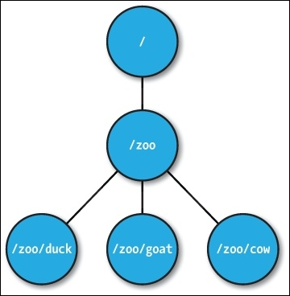

# [Zookeeper](https://draveness.me/zookeeper-chubby)

## 集群

一个 ZooKeeper 集群通常由一组机器组成，一般 3 台以上就可以组成一个可用的 ZooKeeper 集群了。组成 `ZooKeeper` 集群的每台机器都会在内存中维护当前的服务器状态，并且每台机器之间都会互相保持通信。 ZooKeeper 本身就是一个 **复制和分布式** 应用程序，其目的作为服务运行，类似于我们运行DNS或任何其他集中式服务的方式。

> ZK 集群 **半数以上存活** 即可用

ZooKeeper 的客户端程序会选择和集群中的任意一台服务器创建一个 TCP 连接，而且一旦客户端和服务器断开连接，客户端就会自动连接到集群中的其他服务器。

ZooKeeper 集群中包含以下角色：

  - **领导者（leader）**：负责进行投票的发起和决议，更新系统状态；
  - **学习者（learner）**：包括跟随者（follower）和观察者（observer）， `follower` 用于接受客户端请求并向客户端返回结果，在选主过程中参与投票； `observer` 可以接受客户端连接，将写请求转发给leader，但 **`observer` 不参加投票过程**，只同步 leader 的状态， `observer` 的目的是为了扩展系统，提高读取速度；

## 数据模型

到znode是一个标准的文件系统，层次结构很像一棵树。 需要注意的一些要点如下：

 - 根节点有一个名为 `/zoo` 的子节点，它又有三个 `znode` 。
 - ZooKeeper 树中的每个 `znode` 都由一个路径标识，路径元素由`/`分隔。
 - 这些节点被称为数据寄存器，因为它们可以存储数据。 因此，一个 znode 可以有子节点以及与之相关的数据。 这与文件系统可以把文件作为路径很类似。

znode 中的数据通常以字节格式存储，**每个 znode 中的最大数据大小不超过1 MB**。 ZooKeeper 是为协调而设计的，几乎所有形式的协调数据都比较小， 因此，对数据大小的限制是强制的。

与文件系统中的文件一样， `znode` 维护一个 `stat` 结构，其中包含数据更改的 **版本号** 以及随更改相关的时间戳而更改的 **访问控制列表**。 只要 znode 的数据发生变化，版本号就会增加。 ZooKeeper 使用版本号以及相关的时间戳来验证它的核心内缓存。 znode 版本号还允许客户端通过 ZooKeeper API 更新或删除特定的 znode。 如果指定的版本号与 znode 的当前版本不匹配，则操作失败。 但是，执行 znode 更新或删除操作时，可以通过指定0作为版本号来覆盖。

### Znode 类型

  - persistent
  - ephemeral
  - sequential

### Watcher

`ZooKeeper` 的设计是一种可伸缩的、健壮的集中式服务。在客户端访问此类服务时，常见的设计模式是通过轮询或拉式（pull）模型。当在大型和复杂的分布式系统中实现时，拉模型常常会受到可伸缩性问题的影响。为了解决这个问题，ZooKeeper设计了一种机制，**客户端可以从 ZooKeeper 服务中获取通知。客户端接收到这个消息通知之后，需要主动到服务端获取最新的数据**。

客户可以使用 `ZooKeeper` 服务注册与 `znode` 相关的任何更改。 这种注册被称为在 `ZooKeeper` 术语中的 `znode` 上设置 `watch`。 监视允许客户以任何方式更改 `znode` 时收到通知。 **`Watcher` 是一次性操作**，这意味着它只触发一个通知。 要继续接收通知，客户必须在收到每个事件通知后重新注册一个监视。

监视触发：

  - 对 znode 数据的任何更改，例如使用 `setData` 操作将新数据写入 znode 的数据字段时。
  - 对 znode 的子节点的任何更改。 例如，一个 znode 的子节点被删除。
  - 正在创建或删除的 znode ，如果将新的 znode 添加到路径中或现有的 znode 被删除，则可能发生这种情况。

同样，ZooKeeper 针对监视和通知声明以下保证：

  - ZooKeeper 确保监视始终以先进先出（FIFO）方式排序，并且通知总是按顺序发送
  - 在对同一个 znode 进行任何其他更改之前，监视会将通知发送给客户端
  - 监视事件的顺序是按照 ZooKeeper 服务的更新顺序排列的

## 应用场景

### 发布订阅

通过 Zookeeper 进行数据的发布与订阅其实可以说是它提供的最基本功能，它能够允许多个客户端同时订阅某一个节点的变更并在变更发生时执行我们预先设置好的回调函数，在运行时改变服务的配置和行为

### 命名服务

除了实现服务配置数据的发布与订阅功能，Zookeeper 还能帮助分布式系统实现命名服务，在每一个分布式系统中，客户端应用都有根据指定名字获取资源、服务器地址的需求，在这时就要求整个集群中的全部服务有着唯一的名字。

在大型分布式系统中，有两件事情非常常见，一是不同服务之间的可能拥有相同的名字，另一个是同一个服务可能会在集群中部署很多的节点，Zookeeper 就可以通过文件系统和顺序节点解决这两个问题。

### 协调分布式事务

Zookeeper 的另一个作用就是担任分布式事务中的协调者角色，在之前介绍 分布式事务 的文章中我们曾经介绍过分布式事务本质上都是通过 2PC 来实现的，在两阶段提交中就需要一个协调者负责协调分布式事务的执行。

所有的事务参与者会向当前节点中写入提交或者终止，一旦当前的节点改变了事务的状态，其他节点就会得到通知，如果出现一个写入终止的节点，所有的节点就会回滚对分布式事务进行回滚。

### 分布式锁

在数据库中，锁的概念其实是非常重要的，常见的关系型数据库就会对排他锁和共享锁进行支持，而 `Zookeeper` 提供的 API 也可以让我们非常简单的实现分布式锁。

作为分布式协调服务，Zookeeper 的应用场景非常广泛，不仅能够用于服务配置的下发、命名服务、协调分布式事务以及分布式锁，还能够用来实现微服务治理中的服务注册以及发现等功能，这些其实都源于 Zookeeper 能够提供高可用的分布式协调服务，能够为客户端提供分布式一致性的支持。

## FAQ

这段时间来，也在和公司里的一些同学交流使用zk的心得，整理了一些常见的zookeeper问题。这个页面的目标是解答一些zk常见的使用问题，同时也让大家明确zk不能干什么。页面会一直更新。

### 1. 客户端对 ServerList 的轮询机制是什么

随机，客户端在初始化( `new ZooKeeper(String connectString, int sessionTimeout, Watcher watcher)` )的过程中，将所有 `Server` 保存在一个 `List` 中，然后随机打散，形成一个环。之后从 0 号位开始一个一个使用。两个注意点：
  1. Server地址能够重复配置，这样能够弥补客户端无法设置Server权重的缺陷，但是也会加大风险。（比如: `192.168.1.1:2181,192.168.1.1:2181,192.168.1.2:2181`).
  2. 如果客户端在进行 `Server` 切换过程中耗时过长，那么将会收到 `SESSION_EXPIRED` . 这也是上面第1点中的加大风险之处。

### 2. 客户端如何正确处理 CONNECTIONLOSS (连接断开) 和 SESSIONEXPIRED (Session 过期)两类连接异常

在 ZooKeeper 中，服务器和客户端之间维持的是一个 **长连接**，在 `SESSION_TIMEOUT` 时间内，服务器会确定客户端是否正常连接(客户端会定时向服务器发送 `heart_beat` ),服务器重置下次 `SESSION_TIMEOUT` 时间。因此，在正常情况下， `Session` 一直有效，并且 **`zk` 集群所有机器上都保存这个 `Session` 信息**。在出现问题情况下，客户端与服务器之间连接断了（客户端所连接的那台zk机器挂了，或是其它原因的网络闪断），这个时候客户端会主动在地址列表（初始化的时候传入构造方法的那个参数 `connectString` ）中选择新的地址进行连接。  

好了，上面基本就是服务器与客户端之间维持长连接的过程了。在这个过程中，用户可能会看到两类异常 `CONNECTIONLOSS` (连接断开) 和 `SESSIONEXPIRED` (Session 过期)。

  - `CONNECTIONLOSS` ：应用在进行操作A时，发生了 `CONNECTIONLOSS` ，此时用户不需要关心我的会话是否可用，应用所要做的就是等待客户端帮我们自动连接上新的 `zk` 机器，一旦成功连接上新的 `zk` 机器后，确认刚刚的操作A是否执行成功了。  
  - `SESSIONEXPIRED` ：这个通常是zk客户端与服务器的连接断了，试图连接上新的 `zk` 机器，这个过程如果耗时过长，超过 `SESSION_TIMEOUT` 后还没有成功连接上服务器，那么服务器认为这个 `session` 已经结束了（服务器无法确认是因为其它异常原因还是客户端主动结束会话），开始清除和这个会话有关的信息，包括这个会话创建的临时节点和注册的 `Watcher` 。在这之后，客户端重新连接上了服务器在，但是很不幸，服务器会告诉客户端 `SESSIONEXPIRED` 。此时客户端要做的事情就看应用的复杂情况了，总之，要重新实例 `zookeeper` 对象，重新操作所有临时数据（包括临时节点和注册 `Watcher` ）。

### 3. 不同的客户端对同一个节点是否能获取相同的数据

### 4. 一个客户端修改了某个节点的数据，其它客户端能够马上获取到这个最新数据吗

`ZooKeeper` **不能确保任何客户端能够获取（即 `Read Request` ）到一样的数据**，除非客户端自己要求：方法是客户端在获取数据之前调用`org.apache.zookeeper.AsyncCallback.VoidCallback, java.lang.Object) sync`.  

通常情况下（这里所说的通常情况满足：1. 对获取的数据是否是最新版本不敏感，2. 一个客户端修改了数据，其它客户端需要不需要立即能够获取最新），可以不关心这点。  

在其它情况下，最清晰的场景是这样：ZK 客户端 A 对 `/my_test` 的内容从 `v1->v2`, 但是 ZK 客户端 B 对 `/my_test` 的内容获取，依然得到的是 `v1`. 请注意，这个是实际存在的现象，当然延时很短。解决的方法是客户端B先调用 `sync()`, 再调用 `getData()`.

### 5. ZK为什么不提供一个永久性的Watcher注册机制

不支持用持久Watcher的原因很简单，ZK无法保证性能。

### 6. 使用watch需要注意的几点

  1. `Watches` 通知是一次性的，必须重复注册.  
  1. 发生 `CONNECTIONLOSS` 之后，只要在 `session_timeout` 之内再次连接上（即不发生 `SESSIONEXPIRED` ），那么这个连接注册的 `watches` 依然在。  
  1. 节点数据的版本变化会触发 `NodeDataChanged` ，注意，这里特意说明了是版本变化。存在这样的情况，只要成功执行了 `setData()`方法，无论内容是否和之前一致，都会触发 `NodeDataChanged` 。  
  1. 对某个节点注册了 `watch` ，但是节点被删除了，那么注册在这个节点上的 `watches` 都会被移除。  
  1. 同一个 zk 客户端对某一个节点注册相同的 `watch` ，只会收到一次通知。
  1. `Watcher` 对象只会保存在客户端，不会传递到服务端。

### 7. 我能否收到每次节点变化的通知

**如果节点数据的更新频率很高的话，不能**。

原因在于：当一次数据修改，通知客户端，客户端再次注册 `watch` ，在这个过程中，可能数据已经发生了许多次数据修改，因此，千万不要做这样的测试："数据被修改了n次，一定会收到n次通知"来测试 `server` 是否正常工作。

### 8. 能为临时节点创建子节点吗

不能。

### 9. 是否可以拒绝单个IP对ZK的访问,操作

ZK 本身不提供这样的功能，它仅仅提供了对单个 IP 的连接数的限制。你可以通过修改 iptables 来实现对单个 ip 的限制。

### 10. 在[`getChildren(String path, boolean watch)`]注册对节点子节点的变化，那么子节点的子节点变化能通知吗

不能

### 11. 创建的临时节点什么时候会被删除，是连接一断就删除吗？延时是多少？

连接断了之后，ZK 不会马上移除临时数据，只有当 `SESSIONEXPIRED` 之后，才会把这个会话建立的临时数据移除。因此，用户需要谨慎设置 `Session_TimeOut`

### 12. zookeeper是否支持动态进行机器扩容？如果目前不支持，那么要如何扩容呢？

3.4.3版本的zookeeper，还不支持这个功能，在3.5.0版本开始，支持动态加机器了。

### 13. ZooKeeper集群中个服务器之间是怎样通信的？

Leader服务器会和每一个 `Follower/Observer` 服务器都建立TCP连接，同时为每个 `F/O` 都创建一个叫做 `LearnerHandler` 的实体。LearnerHandler 主要负责 Leader 和 F/O 之间的网络通讯，包括数据同步，请求转发和 `Proposal` 提议的投票等。Leader 服务器保存了所有 F/O 的 `LearnerHandler` 。

### 14.zookeeper是否会自动进行日志清理？如果进行日志清理？

zk自己不会进行日志清理，需要运维人员进行日志清理

## 参考文档

[ZooKeeper FAQ](http://jm.taobao.org/2013/10/07/zookeeper-faq/)
[Apache ZooKeeper数据模型](https://www.cnblogs.com/IcanFixIt/p/7818592.html)
